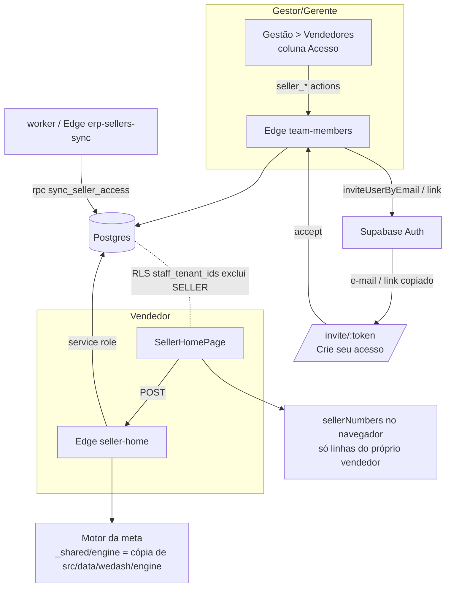

# Acesso do vendedor Design

**Spec**: `.specs/features/acesso-vendedor/spec.md`
**Status**: Approved

---

## Architecture Overview

O vendedor nunca lê tabela da empresa. A tela Início pede tudo a uma Edge Function (`seller-home`) que roda com service role, busca os agregados da loja, executa **a mesma conta de meta das telas do gestor** (motor puro compartilhado) e devolve um pacote já filtrado: a premiação e as vendas do próprio vendedor e, dos colegas, só nome, % e nível. Uma migration tira o papel `SELLER` de todas as policies por empresa.

Abordagem escolhida pelo dono (2026-10-03) entre três: (1) intermediário no servidor com a mesma conta ✅; (2) conta reescrita em SQL — descartada: duas versões da regra, contraria AD-024; (3) RLS só das próprias linhas + servidor para o ranking — descartada: ranking e modo Grupo precisam das vendas dos colegas, cairia na (2).



---

## Code Reuse Analysis

### Existing Components to Leverage

| Component | Location | How to Use |
| --- | --- | --- |
| `buildGoalCardView`, `sellerGoalLevels`, `goalStatus` | `src/data/wedash/goalView.ts` | Movidos para o motor puro; ranking e premiação saem daqui (mesmos números do detalhe da pessoa) |
| `weekdayWeights` | `src/data/wedash/goalCurve.ts` | Pesos por dia da semana para a projeção (regra da Visão geral) |
| `excludeNonSalesPeople`, `NonSalesPeople` | `src/data/wedash/salesRepo.ts:458` | Movidos para o motor; Edge e navegador tiram gerência igual |
| Parsers `goalFromRow`, `parseTiers`, team member | `src/data/wedash/goalsRepo.ts` | Movidos para o motor (Edge lê as linhas do banco com a mesma conversão) |
| Fluxo de convite | `supabase/functions/team-members/index.ts` | Ganha ações `seller_*`; `invite_info`/`accept` passam a tratar `SELLER` |
| "Crie seu acesso" / `/invite/:token` | `src/pages/access/Invite.tsx` | Texto com a loja quando `role = SELLER` |
| `BlocoRanking` (pódio) | `src/pages/live/blocos.tsx:40` | Pódio do ranking; ganha variante por % (sem R$) |
| `GoalLevelsBar` / `GoalLevelSummary` | `src/components/wedash/GoalLevelsBar.tsx` | Barra de níveis do bloco Premiação |
| `StatCard`, `Segmented`, `EmptyBlock`, `useMinSkeleton` | `src/components/ui`, `src/pages/dashboard` | Seus números (Hoje/Mês), vazios, skeleton |
| `kpiDelta`, `tipDelta` | `src/data/wedash/dashboard.ts` | Badges de comparação dos números (navegador) |
| `link_seller_day_aggs` call sites | `workers/millennium-sync/src/deps.ts:735`, `supabase/functions/erp-sellers-sync/index.ts:83` | Mesmo ponto chama `sync_seller_access` |
| `navVendedora`, `homeForRole` | `src/layout/nav-wedash.ts`, `src/session/RequireSession.tsx` | Menu Início + Meu perfil; home do SELLER |

### Integration Points

| System | Integration Method |
| --- | --- |
| Supabase Auth | `inviteUserByEmail` (já usado); link copiado = `auth.users.confirmation_token` lido por RPC security definer (é o mesmo `TokenHash` do e-mail — confirmado no código do GoTrue `sendInvite`) |
| Postgres RLS | Função `staff_tenant_ids()` substitui o subselect de memberships em todas as policies por empresa |
| Sincronização da equipe | RPC `sync_seller_access(tenant, store)` após `link_seller_day_aggs` (worker e Edge) |

---

## Components

### Motor da meta (engine)

- **Purpose**: Conta pura de meta/ranking/projeção usada pelo navegador e pela Edge.
- **Location**: `src/data/wedash/engine/` (fonte) → cópia gerada em `supabase/functions/_shared/engine/`
- **Interfaces**:
  - `goalTypes.ts` — `Tier`, `GoalRecord`, `GoalGroup`, `GoalTeamMember`, `GoalCardView`, `SellerRow`, `SalesDayAgg`, `SalesSellerDayAgg` (re-exportados pelos módulos atuais para não quebrar imports)
  - `goalView.ts` — o código atual de `src/data/wedash/goalView.ts` (o arquivo antigo vira re-export)
  - `goalRows.ts` — `goalFromRow(row)`, `teamMemberFromRow(row)`, `sellerDayFromRow(row)`, `excludeNonSalesPeople(rows, people)`
  - `sellerHome.ts` — `buildSellerHome(input): SellerHomeStore[]` e `projectedPrize(...)`
- **Dependencies**: nenhuma além do próprio motor; só imports relativos com extensão `.ts` (Deno e Vite).
- **Reuses**: `goalView.ts`, `goalCurve.weekdayWeights`, `format.ts` (copiado para `engine/format.ts` ou importado relativo).
- **Cópia**: `npm run sync:engine` copia a pasta; teste vitest falha se `_shared/engine` diferir da fonte (padrão "manter iguais" do projeto, agora verificado).

### Edge `seller-home`

- **Purpose**: Entregar ao vendedor logado o pacote da tela Início, sem dado alheio.
- **Location**: `supabase/functions/seller-home/index.ts`
- **Interfaces**:
  - `POST {}` → `{ ok: true, home: SellerHomePayload }` | `{ error: "forbidden" | "not_linked" }`
- **Fluxo**: auth → membership `SELLER` `ACTIVE` → `store_seller` com `membership_id` → lojas (fantasia, fuso, `last_sync_at`) → metas ativas hoje → agregados (dia ALL da loja, vendas por pessoa, equipe, quem não é da equipe) → `buildSellerHome` → resposta.
- **Dependencies**: service role; motor da meta.
- **Reuses**: padrão de auth das Edges existentes (`team-members`).

### Edge `team-members` (ações do vendedor)

- **Purpose**: Convite e ciclo de vida do acesso do vendedor.
- **Location**: `supabase/functions/team-members/index.ts`
- **Interfaces** (todas com `storeSellerId`):
  - `seller_list {storeId}` → `[{ storeSellerId, access: "NONE"|"PENDING"|"ACTIVE"|"SUSPENDED", email }]`
  - `seller_invite {storeSellerId, email}` → `{ ok, linked?: true }` (e-mail de outra conta SELLER da empresa = liga sem novo e-mail)
  - `seller_link {storeSellerId}` → `{ ok, url }` (mesmo link do e-mail)
  - `seller_resend | seller_revoke | seller_suspend | seller_reactivate {storeSellerId}`
  - `invite_info` passa a devolver `storeName` quando `role = SELLER`
- **Autorização**: OWNER/ADMIN_GLOBAL em qualquer loja da empresa; MANAGER só nas lojas do `membership_store` (vazio = todas); outro papel → 403. Só pessoa ativa com cargo VENDEDOR pode ser convidada.
- **Reuses**: `inviteUserByEmail`, `emailOk`, rollback, `deleteUser` do fluxo do Gerente.

### Tela Início do vendedor

- **Purpose**: Premiação · Seus números · Ranking da loja.
- **Location**: `src/pages/seller/SellerHomePage.tsx` (+ `PrizeCard.tsx`, `NumbersCard.tsx`, `RankingCard.tsx`), rota `paths.seller.home = "/home"`; `/my-goal`, `/minha-meta` redirecionam.
- **Interfaces**: `fetchSellerHome(): Promise<SellerHomePayload | null>` em `src/data/wedash/sellerHomeRepo.ts`; `sellerNumbers(rows, period, today)` puro em `src/data/wedash/sellerNumbers.ts`.
- **Reuses**: `BlocoRanking`, `GoalLevelsBar`, `StatCard`, `Segmented`, `EmptyBlock`, `useMinSkeleton`, recarrega com `SALES_SYNCED_EVENT`/volta ao app.

### Gestão > Vendedores — coluna Acesso

- **Purpose**: Convidar e gerenciar o acesso por pessoa.
- **Location**: `src/pages/management/StaffPage.tsx` + `InviteSellerModal.tsx`; repo `src/data/wedash/sellerAccess.ts`.
- **Reuses**: `DataTable`, `Badge`, `Dropdown`, `Modal`, `FormField`, toasts e padrões de Conta > Usuários.

### Ciclo de vida (banco)

- **Purpose**: Desligado no Millennium perde o acesso.
- **Location**: migration `…_seller_access.sql` (`sync_seller_access`), chamada no worker e na Edge `erp-sellers-sync`.
- **Regra**: para cada `store_seller` inativo (ou `in_erp = false`) com `membership_id`: ACTIVE → SUSPENDED; PENDING → apaga a membership, limpa `membership_id` e, se a identity ficou sem membership e ainda PENDING, apaga o usuário do Auth. Pessoa ligada a outra loja ainda ativa: só desliga esta loja (`membership_store` + `membership_id`).

---

## Data Models

### Banco (migration `seller_access`)

```sql
alter table store_seller add column membership_id uuid references membership(id) on delete set null;
create unique index store_seller_membership_store on store_seller (store_id, membership_id) where membership_id is not null;

-- policies por empresa passam a usar:
create function public.staff_tenant_ids() returns setof uuid
  language sql stable security definer set search_path = public as $$
  select m.tenant_id from membership m join identity i on i.id = m.identity_id
  where i.auth_user_id = auth.uid() and m.status = 'ACTIVE' and m.role <> 'SELLER' $$;

create function public.invite_link_token(p_auth_user_id uuid) returns text  -- só service_role
create function public.sync_seller_access(p_tenant_id uuid, p_store_id uuid) returns void -- só service_role
```

O vendedor continua lendo: a própria `identity`, `membership`, `membership_store`, `tenant` (nome), `announcement` publicado e as RPCs da conta (`touch_last_seen`, notificações).

### Pacote da tela Início

```typescript
interface SellerHomePayload {
  today: string;                       // fuso da 1ª loja
  name: string;
  stores: SellerHomeStore[];
  /** Só linhas do próprio vendedor, do início do período anterior até hoje. */
  myDays: { storeId: string; day: string; revenue: number; sales: number; items: number | null }[];
  numbersPeriod: { from: string; to: string };   // meta ativa ou mês calendário
}
interface SellerHomeStore {
  storeId: string; storeName: string; lastSyncAt: string | null;
  goal: null | {
    name: string; startsOn: string; endsOn: string; mode: "individual" | "grupo";
    me: SellerGoalLevel | null;                  // null = fora dos grupos da meta
    nextLevelGain: number | null;                // premiação no próximo nível − agora + bônus dele
    projectedPrize: number | null;               // null antes da metade do período
    ranking: { position: number; name: string; pct: number; level: string | null; me: boolean }[];
  };
}
```

`ranking` não tem campo em R$ por construção; teste do motor garante.

---

## Error Handling Strategy

| Error Scenario | Handling | User Impact |
| --- | --- | --- |
| E-mail inválido | Validação no modal e na Edge (`invalid_email`) | "Informe um e-mail válido." |
| E-mail de Gestor/Gerente/outra empresa | `email_in_use` | "Este e-mail já tem acesso à WeDash com outro tipo de acesso." |
| Envio do e-mail falhou | Rollback do usuário criado | Toast "Não foi possível enviar o convite. Tente novamente."; continua "Sem acesso" |
| Clique duplo / convite simultâneo | Unique de membership + checagem de PENDING existente | Um convite só |
| Gerente fora das lojas dele / vendedor chamando ação | 403 | Toast de permissão |
| `seller-home` falhou | Repo devolve null | Card de erro com "Tentar novamente" |
| Vendedor sem `store_seller` ligado | `not_linked` | Vazio "Seu acesso ainda não está ligado a uma loja. Fale com a gerência." |
| Login suspenso | Login confere membership SUSPENDED de SELLER e faz signOut | "Seu acesso está suspenso. Fale com a gerência da loja." |

---

## Risks & Concerns

| Concern | Location (file:line) | Impact | Mitigation |
| --- | --- | --- | --- |
| Policies por empresa liberam tudo para qualquer membership ativa (≈60 policies inline) | `supabase/migrations/*` (ex.: `20260923190000_sales_seller_day_agg.sql`) | Vendedor leria Financeiro, CMV e vendas dos colegas | Migration recria cada policy com `staff_tenant_ids()`; script `scripts/check-seller-isolation.mjs` loga como vendedor e consulta todas as tabelas `public` esperando 0 linhas |
| Conta da meta acoplada a fixture e Supabase via tipos | `src/data/wedash/goalView.ts:2-4`, `goalsRepo.ts:1-3` | Edge não consegue importar | Extrair `engine/` com tipos e parsers próprios; arquivos antigos re-exportam |
| Import de fora de `supabase/functions` é instável no deploy (regressões do CLI) | Supabase CLI issues #3467, #2533 | Deploy da Edge quebra | Cópia gerada `_shared/engine` + teste de igualdade, sem depender do bundler |
| Consultas da Edge duplicam filtros do repo (paginação 1000, brand ALL, gerência) | `src/data/wedash/salesRepo.ts` | Número do vendedor diverge do gestor | Parsers e `excludeNonSalesPeople` no motor; UAT compara com o detalhe da pessoa (AC de igualdade) |
| Link copiado depende de `auth.users.confirmation_token` (interno do GoTrue) | GoTrue `internal/api/mail.go` `sendInvite` | Link copiado inválido após upgrade do Auth | 1ª tarefa valida na prática; fallback `generateLink` com aviso "o link do e-mail deixa de valer" |
| Identity PENDING órfã bloqueia novo convite (`email_in_use`) | `team-members/index.ts:247-256` | Reconvidar quem teve convite cancelado pelo desligamento falha | `sync_seller_access` apaga o usuário do Auth quando a identity fica sem membership; `seller_invite` trata identity sem membership como livre |
| Hooks do shell leem dados de gestor (ERP, sino de problemas) | `src/layout/AppShell.tsx`, `useNotifications.ts` | Erro ou aviso indevido para o vendedor | Pular essas leituras quando `role = SELLER`; teste manual no UAT |
| Sessão suspensa continua aberta até recarregar | `src/session/authApi.ts:294` | Vendedor desligado vê a tela até recarregar | Aceito (#40); `seller-home` exige membership ACTIVE, então os dados já param de vir |
| Cold start da Edge | `seller-home` | ~0,5–1 s a mais na 1ª abertura | Skeleton com `useMinSkeleton`; consultas em paralelo |

---

## Tech Decisions

| Decision | Choice | Rationale |
| --- | --- | --- |
| Dados do vendedor | Só pela Edge `seller-home`, pacote filtrado | Privacidade no servidor; vendedor sem leitura direta |
| Compartilhar a conta da meta com a Edge | Cópia gerada + teste de igualdade | Deploy previsível; mesma regra nos dois lados (AD-024) |
| Exclusão do SELLER nas policies | Função `staff_tenant_ids()` | Uma regra em um lugar; policies novas usam a mesma |
| Link copiado | Ler o token do convite já enviado | Mesmo link do e-mail; Reenviar troca os dois |
| Ligação conta ↔ cadastro do Millennium | `store_seller.membership_id` | Uma conta, vários cadastros (várias lojas) |
| Seus números | Calculados no navegador a partir das linhas do próprio vendedor | Dado dele; reaproveita `kpiDelta` sem levar `dashboard.ts` para a Edge |
| Projeção | Vendido até ontem ÷ peso dos dias fechados × peso de todos os dias da meta (`weekdayWeights`, 6 semanas da loja); depois da metade | Mesma regra da Visão geral; no modo Grupo sobre a soma do grupo |
