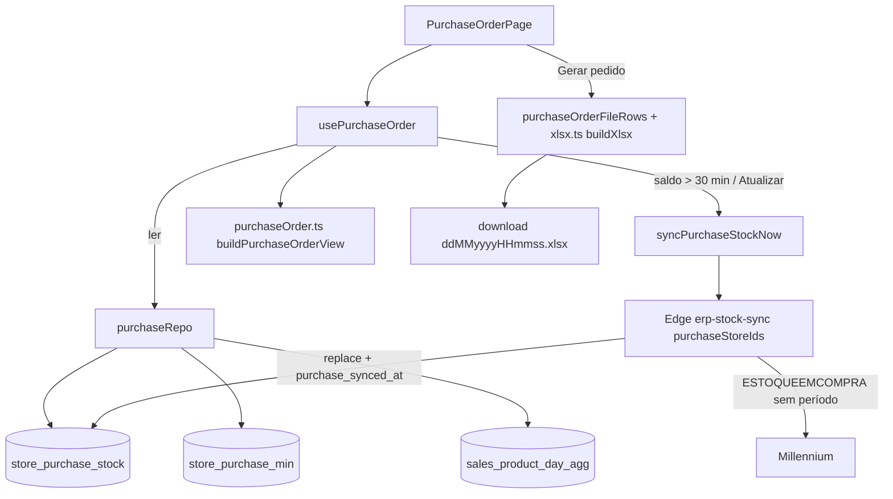

# Pedido de compra — Design

**Spec**: `.specs/features/pedido-compra/spec.md`
**Status**: Draft

---

## Approach Exploration

| # | Abordagem | Prós | Contras |
| --- | --- | --- | --- |
| **A (recomendada)** | Nova parte `purchaseStoreIds` na Edge `erp-stock-sync` grava o Saldo Atual e Futuro numa tabela própria (`store_purchase_stock`); mínimos em `store_purchase_min`; conta e arquivo calculados no navegador em módulos puros com testes | Mesmo fluxo validado do Estoque (sessão salva, 401 → login, gerente só nas lojas dele); "manter o último saldo se a busca falhar" sai de graça; regra testável sem ERP (AD-024) | Uma tabela a mais |
| B | Reusar `store_stock` (ESTOQUEPORLOCAL) + cadastro do catálogo (múltipla, bloqueado, data) + buscar só os pedidos em aberto | Sem tabela nova de saldo | Três fontes com idades diferentes; bloqueado/múltipla do catálogo só atualizam quando o worker recarrega produtos; variantes não existem no catálogo |
| C | Edge devolve as linhas do relatório na resposta, sem gravar | Nada no banco além dos mínimos | Toda abertura depende do ERP; falha = tela vazia (quebra PC-08 AC 5); horário da busca não é compartilhado entre usuários |

**Escolha: A.**

---

## Architecture Overview



Fluxo ao abrir: lê o saldo guardado + mínimos + vendidos 30 dias → mostra → se `store.purchase_synced_at` tem mais de 30 min (ou nulo) e a integração está conectada, chama a Edge → relê o saldo.

---

## Code Reuse Analysis

### Existing Components to Leverage

| Component | Location | How to Use |
| --- | --- | --- |
| Edge `erp-stock-sync` | `supabase/functions/erp-stock-sync/index.ts` | Nova parte `purchase`; reusa auth, membership (gerente filtrado por `membership_store`), sessão salva, relogin no 401, `replaceRows` |
| `call`/`rowsOf`/`asStr`/`asNum` | `supabase/functions/_shared/millenniumProducts.ts` | Base do novo `fetchPurchaseStock` |
| `useStockData` | `src/pages/stock/useStockData.ts` | Molde do `usePurchaseOrder` (30 min, `fetchErpConnection`, `FORCE_REFRESH_CLICK_EVENT`, `hora()`) |
| `syncStockNow` | `src/data/wedash/stockRepo.ts:168` | Molde do `syncPurchaseStockNow` (invoke + leitura do erro) |
| `fetchAllPages` / `from` | `src/data/wedash/stockRepo.ts` | Paginação de 1000 do PostgREST |
| `fetchSalesProductDayAggs` | `src/data/wedash/salesRepo.ts:571` | Vendidos em 30 dias (Σ `item_count` por `product_code`) |
| `InventoryPage` | `src/pages/stock/InventoryPage.tsx` | Layout: `SectionHeader`, `HeaderFilters`, `HeaderSearch`, `HeaderFilter`, `UpdatedLine`, `ErpStatusNotice`, `Card` + tabela própria, `ThSort`, `ProductNameCell`, `TableFooter`, linha Total do filtro, `Qty` |
| `useScopedStores` | `src/pages/operation/shared.tsx` | Lojas do seletor do topo / da sessão |
| `EmptyBlock`, `Alert`, `Badge`, `Button`, `Input`, `useToast` | `src/components/ui`, `src/pages/dashboard/EmptyBlock.tsx` | Vazios, alerta de saldo velho, selo Novo, toasts |
| `StockProductsSkeleton` | `src/components/wedash/LoadingSkeletons.tsx` | 1ª carga (mesmo card + tabela) |
| `SAVE_ERROR_MSG` | Configurações da operação | Toast de erro ao gravar o mínimo |

### Integration Points

| System | Integration Method |
| --- | --- |
| Millennium | `MILLENIUM!FRANQUIAS.RELATORIOS.ESTOQUEEMCOMPRA` body `{ FILIAL, DESC: null, TIPO: null, DATAI: null, DATAF: null }`, `$top=5000`, 1 chamada por loja |
| Postgres | 2 tabelas novas + `store.purchase_synced_at`; leitura RLS por tenant; gravação do saldo só via service_role (Edge) |
| Catálogo | Edge chama `set_product_catalog_registry` (best-effort) com múltipla/bloqueado/data do mesmo retorno — mantém o catálogo atualizado sem chamada extra |
| Topbar | `FORCE_REFRESH_CLICK_EVENT` com a tela aberta força a busca |

---

## Components

### Migration `20261003120000_purchase_order.sql`

- **Purpose**: guardar o saldo do Saldo Atual e Futuro por loja e os mínimos.
- **Location**: `supabase/migrations/`
- **Reuses**: padrão RLS de `store_stock` (select por tenant) e de `challenge` (escrita por papel).

### `fetchPurchaseStock` (Edge, `_shared/millenniumProducts.ts`)

- **Purpose**: chamar o ESTOQUEEMCOMPRA de uma loja e devolver as linhas normalizadas na ordem do relatório.
- **Interfaces**: `fetchPurchaseStock(session: string, millenniumStoreId: number): Promise<PurchaseStockRow[]>`; `parsePurchaseStock(payload): PurchaseStockRow[]` (puro).
- **Regras**: `SALDO`/`QUANTIDADE_PEDIDO`/`TOTAL` nulos = 0; `BLOQUEADO_COMPRA === true`; `QUANTIDADE_MULTIPLA` ≤ 0 ou nulo = null; `DATA_CADASTRO` → data de Brasília (−3h, igual a `brDate` do worker); `position` = índice no retorno; linhas idênticas (código+cor+estampa+tamanho) somadas.

### Parte `purchase` da Edge `erp-stock-sync`

- **Interfaces**: corpo `{ purchaseStoreIds: string[] }` → `{ ok, purchase: n, failed }`.
- **Faz**: por loja (2 por vez), `fetchPurchaseStock` → `replaceRows("store_purchase_stock", { store_id })` → `store.purchase_synced_at = now()`; depois, 1× por chamada, `set_product_catalog_registry` com o cadastro deduplicado por código (erro só no log).
- **Reuses**: todo o resto da função (auth, gerente, credencial, sessão, 401).

### `purchaseOrder.ts` (puro, com testes)

- **Location**: `src/data/wedash/purchaseOrder.ts`
- **Interfaces**:
  - `purchaseQuantity(total: number, min: number | null, multiple: number, factor: number): number` — PC-09.
  - `isNewProduct(registeredAt: string | null, todayIso: string): boolean` — 0 ≤ dias < 30.
  - `isEligible(row): boolean` — código sem `WP` (sem diferenciar maiúsculas), não bloqueado, múltipla > 0.
  - `buildPurchaseOrderView(input: { stock: PurchaseStockRow[]; mins: Map<string, number>; sold30: Map<string, number>; factor: number; todayIso: string }): PurchaseOrderView` — agrupa variantes elegíveis por código; linhas + contagens (`noPedido`, `semMinimo`, `novos`) + resumo (`produtos`, `itens`).
  - `purchaseOrderFileRows(view): FileRow[]` — linhas do arquivo na ordem do relatório (menor `position` do produto), só quantidade > 0 e sem variantes múltiplas.

### `xlsx.ts` (puro, com testes)

- **Location**: `src/lib/xlsx.ts`
- **Interfaces**: `buildXlsx(rows: XlsxCell[][], opts: { textColumns: number[] }): Uint8Array`; `type XlsxCell = string | number`; `purchaseOrderFileName(d: Date): string` (fica em `purchaseOrder.ts`).
- **Formato**: mesmo esqueleto do exemplo exportado pelo Google — `[Content_Types].xml`, `_rels/.rels`, `xl/workbook.xml`, `xl/_rels/workbook.xml.rels`, `xl/styles.xml` (estilo 0 geral, estilo 1 `numFmtId="49"` texto), `xl/sharedStrings.xml`, `xl/worksheets/sheet1.xml`. Strings via `sharedStrings` (`t="s"`), números como `<v>`; colunas de texto usam o estilo 49. ZIP sem compressão (método 0) com CRC-32 — sem dependência nova.

### `purchaseRepo.ts`

- **Location**: `src/data/wedash/purchaseRepo.ts`
- **Interfaces**:
  - `fetchPurchaseStock(tenantId, storeId): Promise<{ rows: PurchaseStockRow[]; syncedAt: string | null }>`
  - `fetchPurchaseMins(tenantId, storeId): Promise<Map<string, number>>`
  - `savePurchaseMin(tenantId, storeId, code, value: number | null): Promise<boolean>` — null = apaga a linha.
  - `fetchSold30(tenantId, storeId, fromIso, toIso): Promise<Map<string, number>>`
  - `syncPurchaseStockNow(storeIds: string[]): Promise<{ ok: true } | { ok: false; message: string }>`

### `usePurchaseOrder`

- **Location**: `src/pages/stock/usePurchaseOrder.ts`
- **Interfaces**: `usePurchaseOrder(storeId) → { view, loading, syncing, syncedAt, stale, atualizadoTexto, factor, setFactor, saveMin(code, raw) }`.
- **Regras**: busca automática > 30 min; `FORCE_REFRESH_CLICK_EVENT`; integração desligada = não busca; mínimo otimista (aplica, grava, volta + toast se falhar); `factor` estado local (1).

### `PurchaseOrderPage`

- **Location**: `src/pages/stock/PurchaseOrderPage.tsx` (substitui o cabeçalho em branco).
- **Layout**: `SectionHeader` (Estoque › Pedido de compra) · filtros: Loja (só com > 1 loja no escopo), Busca, Filtro (Todos os produtos · Vai para o pedido (N) · Sem mínimo (N) · Novos (N)), Multiplicador (1x–5x), botão primário **Gerar pedido** · linha "Saldo buscado às HH:MM" · avisos (`ErpStatusNotice dado="estoque"`, alerta de saldo velho) · Card **Produtos** com resumo "N produtos · N itens no pedido" · tabela: # · Produto (`ProductNameCell` + aviso de variantes) · Mínimo (input) · Saldo · Pedidos em aberto · Total · Vendidos 30 dias · Múltipla · Novo (Sim/Não) · A pedir · linha Total do filtro · paginação.
- **Mínimo**: `Input` numérico 80px; grava no blur/Enter; Enter pula para o mínimo da linha de baixo.
- **Destaque**: linha com fundo `bg-warn-soft` (token de alerta do Vela) + borda esquerda amarela, igual à marca de linha do Estoque.

---

## Data Models

```sql
create table public.store_purchase_stock (
  tenant_id uuid not null references public.tenant (id) on delete cascade,
  store_id uuid not null references public.store (id) on delete cascade,
  product_code text not null,
  color text not null default '',
  print text not null default '',
  size text not null default '',
  description text not null default '',
  balance numeric(14,3) not null default 0,     -- SALDO
  open_order numeric(14,3) not null default 0,  -- QUANTIDADE_PEDIDO
  total numeric(14,3) not null default 0,       -- TOTAL (= saldo + pedido)
  purchase_multiple integer,
  purchase_blocked boolean not null default false,
  registered_at date,
  position integer not null,                    -- ordem do relatório
  updated_at timestamptz not null default now(),
  primary key (store_id, product_code, color, print, size)
);
alter table public.store add column purchase_synced_at timestamptz;

create table public.store_purchase_min (
  tenant_id uuid not null references public.tenant (id) on delete cascade,
  store_id uuid not null references public.store (id) on delete cascade,
  product_code text not null,
  min_qty integer not null check (min_qty between 0 and 99999),
  updated_at timestamptz not null default now(),
  primary key (store_id, product_code)
);
```

RLS: as duas tabelas com select por tenant (mesmo predicado de `store_stock`). `store_purchase_stock` grava só service_role. `store_purchase_min` grava (insert/update/delete) quem tem membership ACTIVE no tenant com papel OWNER/ADMIN_GLOBAL, ou MANAGER sem `membership_store` (todas as lojas) ou com a loja em `membership_store`.

```typescript
type PurchaseStockRow = {
  code: string; color: string; print: string; size: string; description: string;
  balance: number; openOrder: number; total: number;
  multiple: number | null; blocked: boolean; registeredAt: string | null; position: number;
};
type PurchaseOrderRow = {
  code: string; nome: string; variantes: PurchaseStockRow[]; position: number;
  saldo: number; pedidosAbertos: number; total: number; vendidos30: number; multipla: number;
  minimo: number | null; novo: boolean; variasVariantes: boolean;
  aPedir: number | null;   // null = "—"
  noPedido: boolean;       // destaque
};
```

---

## Error Handling Strategy

| Error Scenario | Handling | User Impact |
| --- | --- | --- |
| ERP falhou / timeout na busca | Edge `ok: false` (ou loja em `failed`); lista segue com o saldo guardado | Alerta "Não foi possível buscar o saldo no Millennium. Tente novamente." |
| Integração desconectada / senha inválida | `fetchErpConnection` antes de chamar; não chama | Só o aviso padrão (`ErpStatusNotice`) |
| Usuário ERP em uso em outro lugar | `erp_busy` | Toast com o texto de sessão em outro local (mesmo do Estoque) |
| Gravar mínimo falhou / RLS negou | Volta ao último valor | Toast `SAVE_ERROR_MSG` |
| Mínimo inválido | Não grava, volta | Toast "Use um número inteiro entre 0 e 99999." |
| Nada abaixo do mínimo | Não gera arquivo | Toast "Nenhum produto abaixo do mínimo." |
| Catálogo (`set_product_catalog_registry`) falhou | Só `console.error` na Edge | Nenhum |

---

## Risks & Concerns

| Concern | Location (file:line) | Impact | Mitigation |
| --- | --- | --- | --- |
| Importador do Millennium pode não aceitar um XLSX gerado à mão (ZIP sem compressão) | `src/lib/xlsx.ts` (novo) | Arquivo recusado | Mesmo esqueleto do exemplo (sharedStrings + numFmt 49); teste lê o ZIP de volta; UAT obrigatório: importar um pedido real antes de dar como pronto |
| Gerente filtrado por `ids.size > 0` (vazio = todas) | `supabase/functions/erp-stock-sync/index.ts:194` | Correto hoje; regra implícita | Reusar o mesmo trecho para `purchaseStoreIds` |
| 1ª chamada ao ERP após login lenta (3,9s sem período; 30s com período na sondagem) | ESTOQUEEMCOMPRA | Busca demorada na 1ª vez | Sem período; timeout 120s já usado; "Buscando saldo…" na tela |
| PostgREST devolve no máx. 1000 linhas | leitura de `store_purchase_stock` | Hoje 610 linhas/loja | `fetchAllPages` |
| Edge Functions não passam pelo `tsc` do build | `supabase/functions/**` | Erro de tipo só no deploy | Parser simples, sem dependência; `deno check` local se disponível; chamada real após o deploy (UAT) |

---

## Tech Decisions

| Decision | Choice | Rationale |
| --- | --- | --- |
| Gerar XLSX | Escritor próprio (~150 linhas), sem lib | 1 aba e 7 colunas; evita dependência pesada (SheetJS/ExcelJS); testável |
| Onde roda a conta | Navegador (`purchaseOrder.ts`) | AD-024: regra de Gestão em módulo puro com teste |
| Busca do saldo | Parte nova da Edge `erp-stock-sync` | Mesmo dado (estoque), mesma sessão e permissões |
| Mínimo vazio × 0 | Vazio apaga a linha; 0 grava 0; os dois = sem mínimo na conta | Respeita o que o usuário digitou |
| Paginação | 50 por página nesta tabela (exceção ao padrão de 10) | Tela de digitação: preencher ~400 mínimos de 10 em 10 = 40 páginas |
| Ordem na tela | Produto A–Z por padrão, cabeçalhos ordenam | Achar o produto; o arquivo mantém a ordem do relatório |
